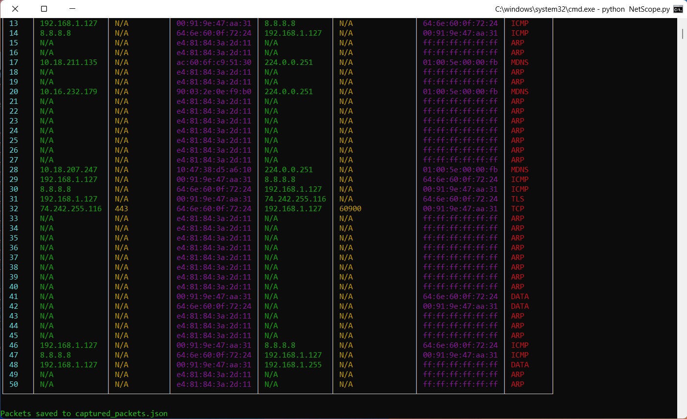
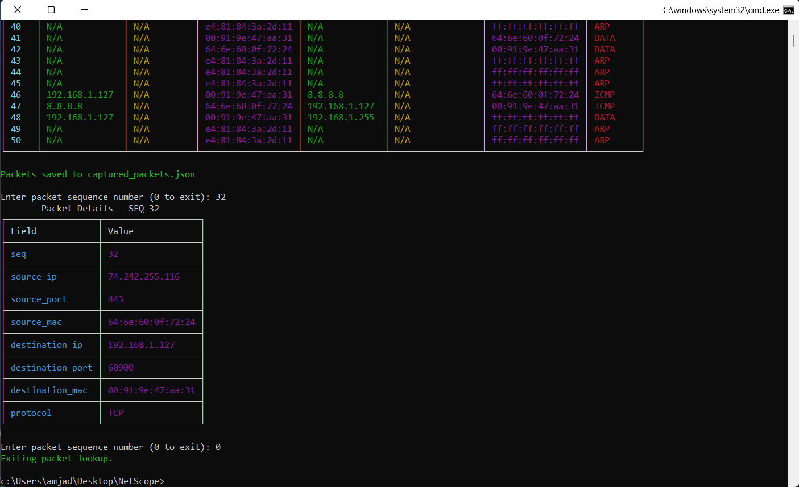

# NetScope – Network Packet Capture & Analysis Tool

  

**NetScope** is a Python-based network packet capture and analysis tool that allows you to monitor, analyze, and investigate network traffic in real-time. It leverages **PyShark** for packet capture and **Rich** for beautiful, interactive, and colored console output.

---

## Features

- **Live Packet Capture**: Capture packets from any network interface.
- **Protocol Filtering**: Supports filtering by `TCP`, `UDP`, `ICMP`, or capture all packets.
- **Packet Count Limit**: Captures **50 packets** per session (configurable).
- **Colorful Live Table**: Displays captured packets in an interactive, colored table with the following columns:
  - SEQ# – Packet sequence number
  - Source IP
  - Source Port
  - Source MAC
  - Destination IP
  - Destination Port
  - Destination MAC
  - Protocol (TCP, UDP, ICMP, ARP, etc.)
- **Packet Details Lookup**: After capture, the user can input a packet **sequence number** to see all details in a colored table.
- **JSON Export**: All captured packets are saved to a JSON file for later analysis.
- **Supports ARP, TCP, UDP, ICMP** and other common network protocols.
- **Handles Missing Fields Gracefully**: Displays `N/A` for unavailable IPs or ports.

---

## Requirements

- Python 3.13+
- [PyShark](https://github.com/KimiNewt/pyshark) (Python wrapper for tshark)
- [Rich](https://github.com/Textualize/rich) (for colored console output)
- **Wireshark/tshark** installed and added to system PATH.

Install dependencies using pip:

```bash
pip install pyshark rich
```

---

## Setup

1. **Set Your Network Interface**

Edit the script and set the interface you want to capture from:

```python
INTERFACE = "\\Device\\NPF_{YOUR_INTERFACE_GUID}"
OUTPUT_FILE = "packets.json"
```

2. **List Available Interfaces**

```python
import pyshark
print(pyshark.LiveCapture().interfaces)
```

---

## Usage

### 1. Start Packet Capture

Run the script:

```bash
python NetScope.py
```

You will be prompted to enter a **filter**:

- `TCP` – capture only TCP packets  
- `UDP` – capture only UDP packets  
- `ICMP` – capture only ICMP packets  
- Leave empty to capture **all packets**

The script will capture **50 packets** and display them live in a **colorful table**.

---

### 2. Live Capture Table

**Columns:**

| SEQ# | Source IP | Source Port | Source MAC | Destination IP | Destination Port | Destination MAC | Protocol |

**Example:**

```
1   192.168.1.5  443  00:1A:2B:3C:4D:5E  192.168.1.100  50123  00:5E:4D:3C:2B:1A  TCP
```

> Each packet updates the table live, showing the latest 50 packets captured.

---

### 3. Packet Details Lookup

After the capture, you can input a **packet sequence number** to view full details:

```text
Enter packet sequence number (0 to exit):
```

**Example Output Table:**

| Field           | Value                       |
|-----------------|-----------------------------|
| seq             | 10                          |
| source_ip       | 192.168.1.5                 |
| source_port     | 443                         |
| source_mac      | 00:1A:2B:3C:4D:5E           |
| destination_ip  | 192.168.1.100               |
| destination_port| 50123                       |
| destination_mac | 00:5E:4D:3C:2B:1A           |
| protocol        | TCP                         |

- Enter `0` to exit the lookup loop.

---

## JSON Export

All captured packets are saved to a JSON file (`packets.json` by default) with the following structure:

```json
[
  {
    "seq": 1,
    "source_ip": "192.168.1.5",
    "source_port": "443",
    "source_mac": "00:1A:2B:3C:4D:5E",
    "destination_ip": "192.168.1.100",
    "destination_port": "50123",
    "destination_mac": "00:5E:4D:3C:2B:1A",
    "protocol": "TCP"
  },
  ...
]
```

This allows **offline analysis** or integration with other tools.

---

## Notes

- ARP packets may show `N/A` for IP and Port fields (normal for Layer 2 protocols).  
- Ensure the script is run with **sufficient permissions** to capture network traffic.  
- Ctrl+C can be used to stop the capture early; packets captured so far will still be saved.

---

## Screenshots

 - ***showing the live table*** 



-   ***showing the details lookup table***



---

## License

This project is licensed under the **MIT License**. See [LICENSE](LICENSE) for details.

---

## Acknowledgements

- [PyShark](https://github.com/KimiNewt/pyshark) – Python wrapper for tshark  
- [Rich](https://github.com/Textualize/rich) – Python console formatting library  
- Wireshark – Network protocol analyzer

